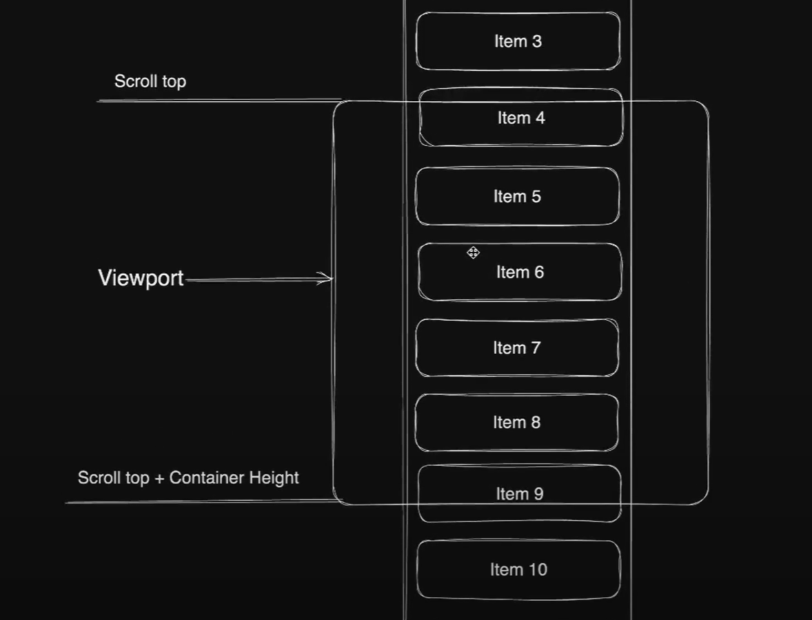

# Simple Virtualized Infinite Scroll
Код написан по данному видео-уроку: https://www.youtube.com/watch?v=o4MWXQli4iI. 
Я сделал 2 версии бесконечной прокрутки, с виртуальным скроллом и без, сравнил производительность в этом `README`.

## Фичи
- Только фиксированный размер элементов и контейнера
- Только горизонтальная виртуализация
- Overscan --- Рендеринг доп. элементов сверху и снизу, чтобы успевало рендерится
- isScrolling --- Если рендерятся картинки/тяжелые компоненты чтобы лишний раз не отправлялись запросы, во время скролла.

## Проблема
`reverse` работает с задержкой. Попытаемся исправить виртуализацией!

Вычисления `calcIndexRange` (8:46):

## Когда использовать?

### Вначале нужно разобраться в devtools и понять как тестировать производительность

## ВИДЕО:
<video width="600" controls>
  <source src="./public/markdown_access/[LESSON 1] Пишем библиотеку для виртуального скролла с нуля React.mp4" type="video/mp4">
  Ваш браузер не поддерживает видео тег.
</video>